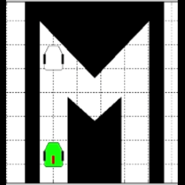
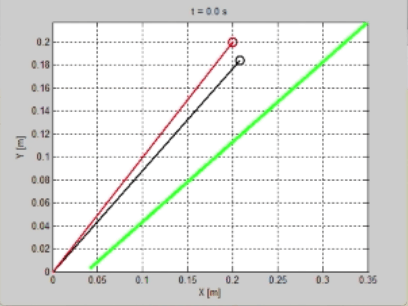
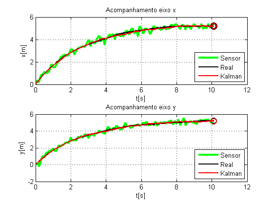
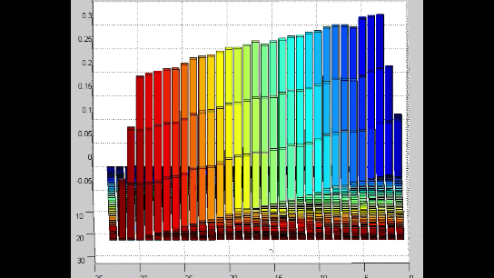
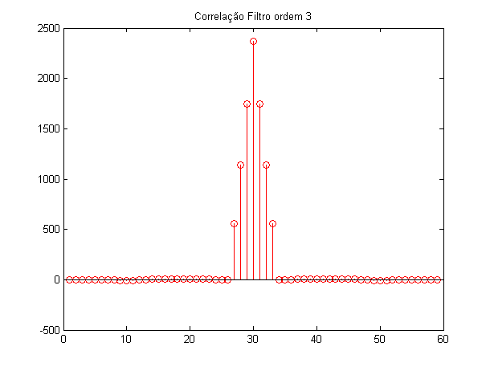
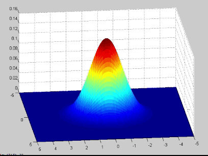

Repository containing codes and files for robotics, control and georeferencing applications and studies, including:

- Twiddle Algorithm
- A* search algorithm
- PID control
- Moving Average Filtering for robotics
- Kalman Filter
- Stochastic methods for analyzing and modeling noise

Most of this repository have been written to be run in MATLAB.

### - **A\* Search Algorithm**

### - **PID Control**

[comment]: <> 

### - **Kalman Filter**

[comment]: <>

[comment]: <>

### - **Signal, noise and covariance studies**

- Covariance with MA filtering

[comment]: <>

- Correlation with MA filtering

[comment]: <>

- White Noise modeling with Gauss distribution

[comment]: <>

